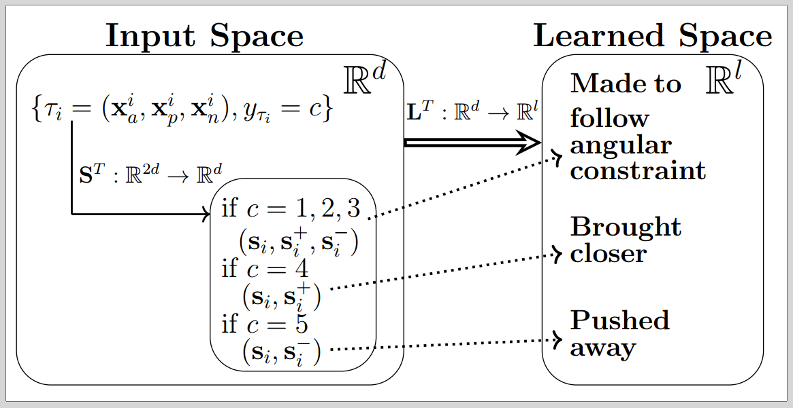

# SUML
Github repository for our AAAI 2020 accepted paper: Unsupervised Metric Learning with Synthetic Examples

In this paper, we use unlabeled data to generate adversarial, synthetic constraints for metric learning. We minimize the entropy of a conditional probability to learn the metric. Our method is called SUML.

# Illustration of SUML

In the above figure, c represents one of the possbile ordering of examples in a randomly sampled triplet.
